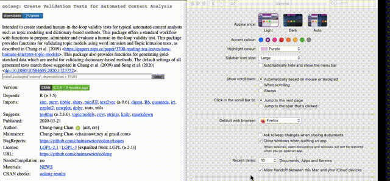

# cranitup

# NOTE

I am no longer developing this userscript. All features of this userscript have been merged into Henrik Bengtsson's [R CRAN Booster](https://github.com/HenrikBengtsson/R_CRAN_Booster/tree/develop) [Chrome Extension, Firefox Add-on]. It's easier to use than this (and of course, more powerful).

# Usage

A client-side enhancement to CRAN.

1. Display download statistic
2. Display age of the latest version
3. Display install.packages command and copy button
4. Dark mode!

# Installation

1. Install [Tampermonkey](https://www.tampermonkey.net/) (Firefox or Chrome)
2. Click [this link](https://raw.githubusercontent.com/chainsawriot/cranitup/master/cranitup.user.js) to install the userscript

